# HireSense

Full-stack recruitment platform built with React + Spring Boot. Candidates search and apply for jobs, employers manage applicants through a 7-stage hiring pipeline, and an AI layer matches resumes to jobs using vector embeddings (semantic, not just keywords).


**Live:** [hire-sense-phi.vercel.app](https://hire-sense-phi.vercel.app) — Quick Demo Login (Candidate / Employer) on the login page lets you try it without signing up.
**Interactive API docs (Swagger):** [/swagger-ui/index.html](https://52-65-41-124.sslip.io/swagger-ui/index.html)
Frontend on Vercel · backend (Dockerized Spring Boot + MySQL + Qdrant) on AWS EC2 with HTTPS via Caddy.

## 📸 Screenshots

**Candidate**

| Landing | Dashboard |
|---|---|
| 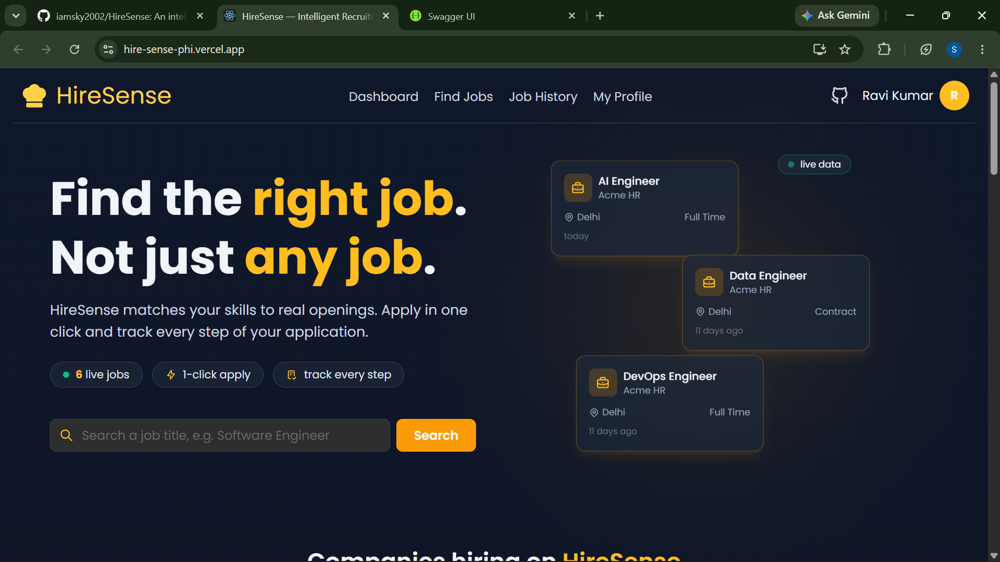 | 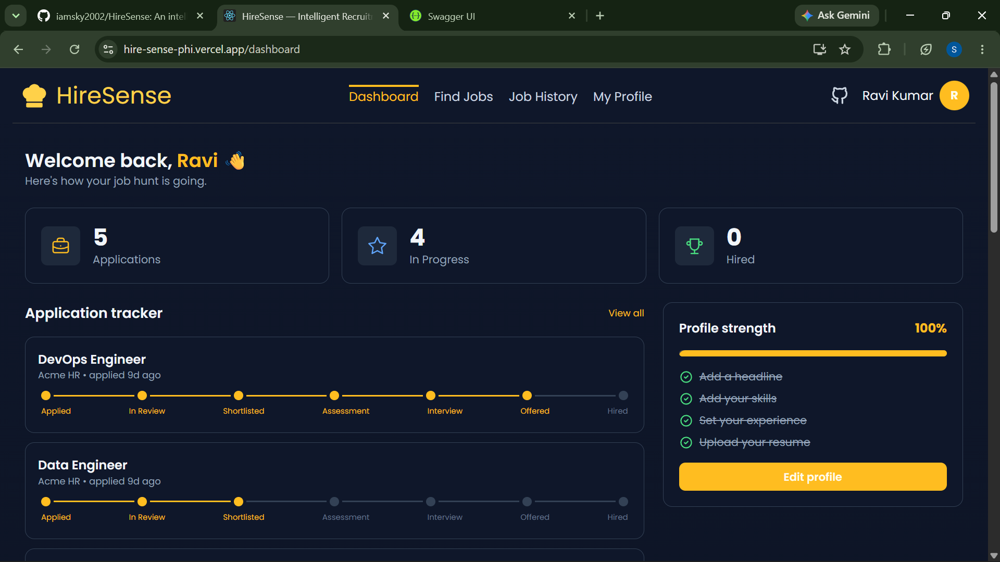 |
| **AI recommendations** | **Find jobs** |
| 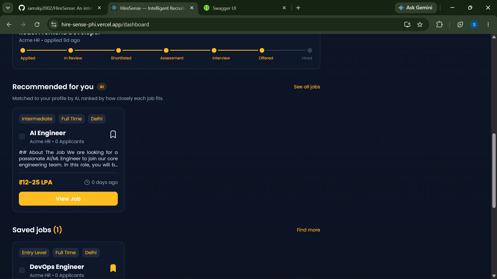 | 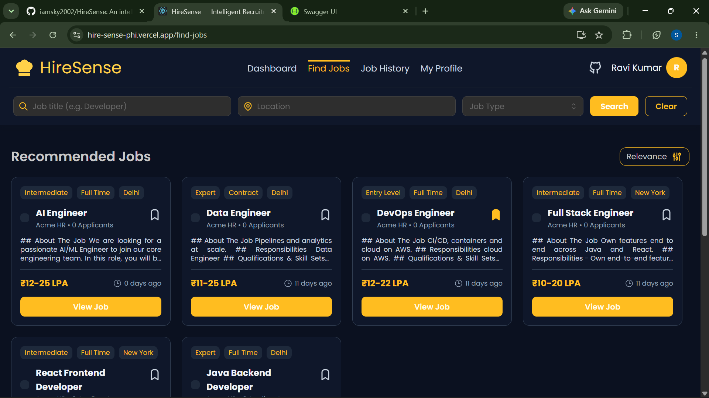 |

**Employer**

| Dashboard | AI "Top matches" for a job |
|---|---|
| 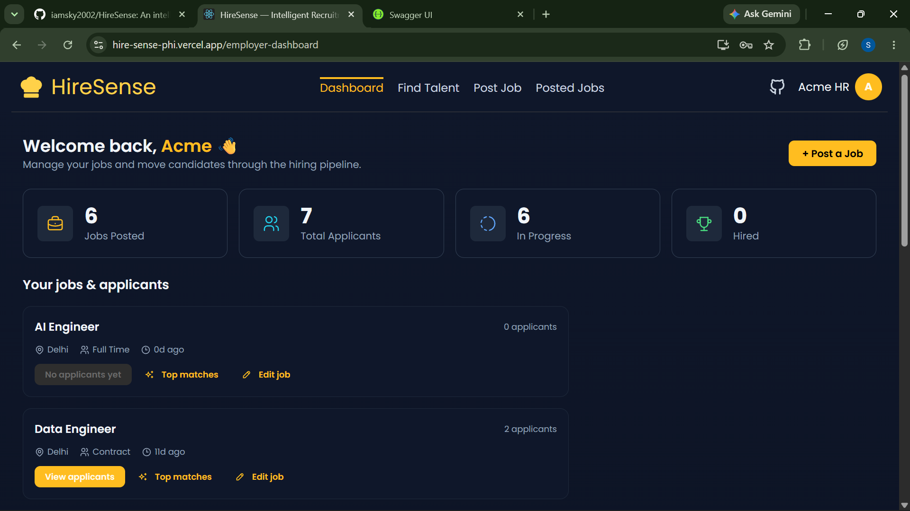 | 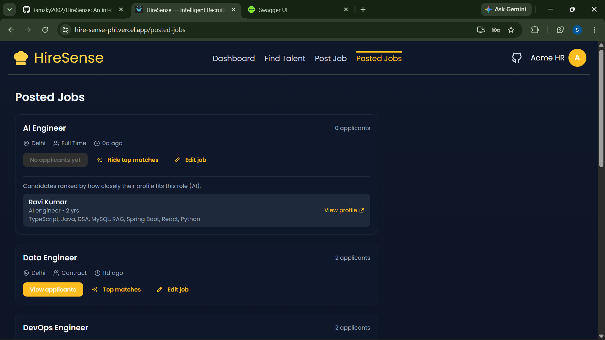 |
| **Posted jobs** | **Find talent** |
| 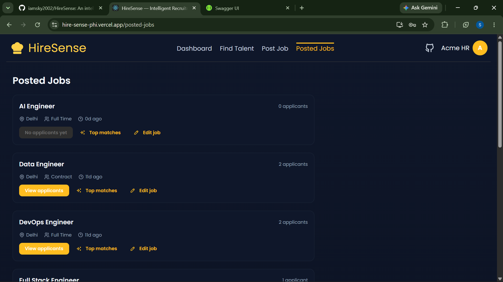 | 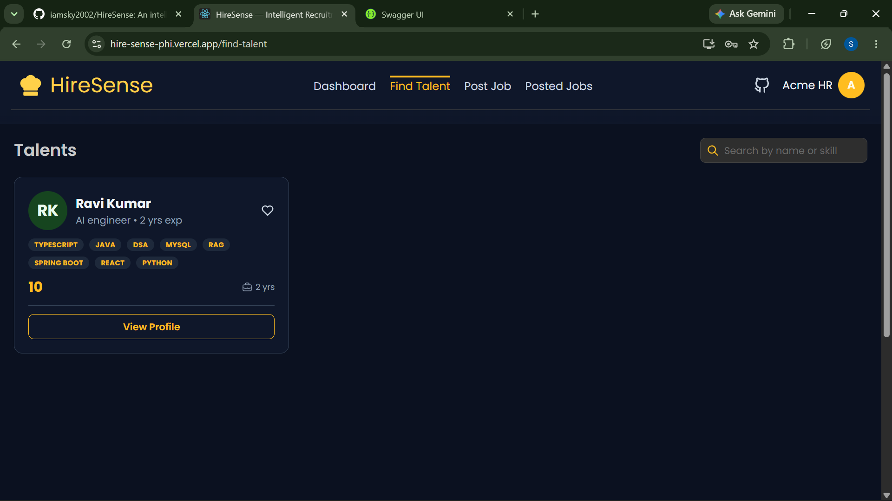 |

**Admin & API docs**

| Admin dashboard | Swagger UI (OpenAPI) |
|---|---|
| 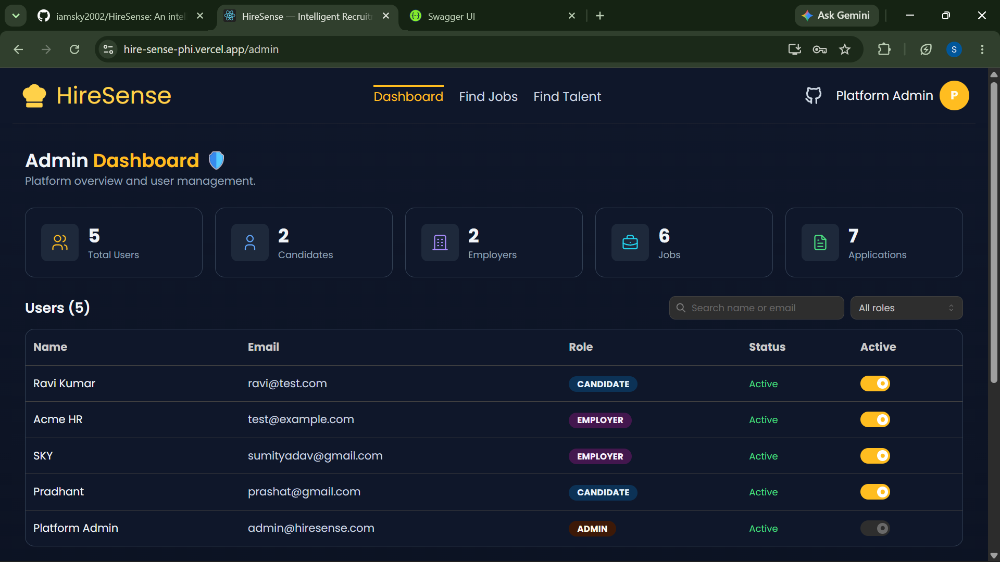 | 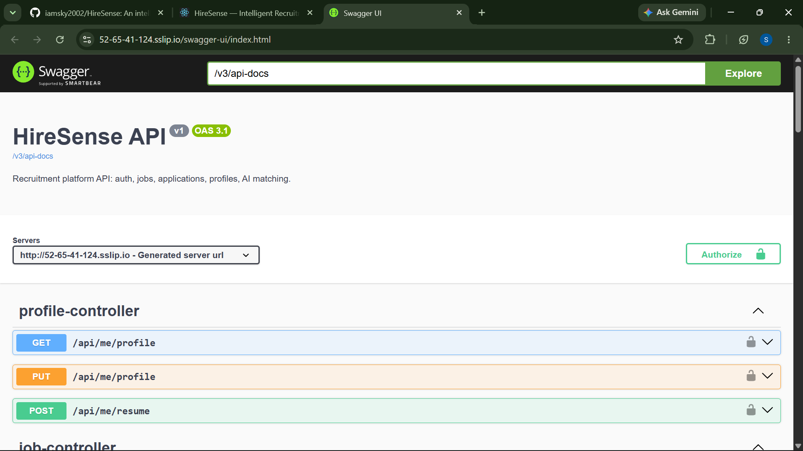 |

## Why I built this

Recruitment platforms combine authentication, authorization, search, workflow management, document handling, and AI-based semantic matching — which makes them a good domain for building and exploring production-style full-stack systems. I wanted one project where every technical decision is something I designed and debugged myself, so I can actually defend it end to end rather than recite a tutorial.

## What it does

**Candidates** — search jobs with filters (title, location, type, salary), apply in one click, bookmark jobs, upload a PDF resume, track each application through the pipeline, and get AI-recommended jobs ranked by how well their profile fits.

**Employers** — post and edit jobs, review applicants, move them through a 7-stage pipeline (Applied → Under review → Shortlisted → Assessment → Interview → Offered → Hired), reject with a reason the candidate can see, and view AI-ranked candidate matches per job.

**Admin** — platform stats and user management (disable actually blocks login at the auth layer, not just a flag).

**Security** — JWT auth, BCrypt passwords, role-based access on every endpoint (`@PreAuthorize`), plus **ownership checks** in the service layer (an employer can only touch their own jobs/applicants). The AI endpoints run through the same RBAC — no raw DB access.

## Architecture

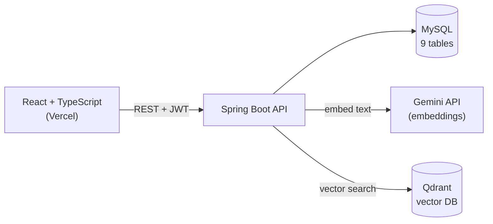

- **Layered + feature-based:** Controller → Service (business logic + RBAC) → Repository, grouped by feature (auth/job/application/...). DTOs everywhere — entities never leak to the API; entity→DTO mapping lives in the service layer.
- **Embed-on-write:** when a job/profile is saved, its text is embedded and upserted into Qdrant right away. Matching is then just a fast cosine search — no embedding at read time for stored items.
- **Best-effort AI:** if Gemini or Qdrant is down (or no key is set), the save still succeeds and the app still runs. AI degrades gracefully; core CRUD never breaks.
- **Stateless JWT:** no server-side sessions, so the backend stays simple.
- **React Context over Redux:** intentional — app state is simple enough that Context + hooks is enough.

## 🤖 How the AI matching works

The headline feature, in detail (this is the part that took the most thought):

- **What gets embedded** — each side is flattened into one text string, then embedded:
  - **Job** → title + experience + required skills + description
  - **Candidate** → headline + years of experience + skills + resume text
- **Model** — Google **`gemini-embedding-001`** over plain REST, **768 dimensions** (`outputDimensionality: 768`, to match the Qdrant collection size). No SDK.
- **Storage** — **Qdrant**, two collections (`jobs`, `candidates`), **cosine** distance.
- **Retrieval** — at request time the query side (the candidate's profile, or the employer's job) is embedded fresh → Qdrant returns the **top-K = 10** nearest by cosine → those ids are loaded from MySQL **in the same ranking order** (ids that no longer exist are dropped).
- **Filtering** — candidate side drops jobs they've already applied to and shows the top few; employer side is ownership-checked.
- **No score threshold / no hybrid search (yet)** — it's pure vector similarity, top-K. Keyword search exists separately (SQL `LIKE` with filters) but isn't fused with vectors yet.
- **Graceful fallback** — if AI is off, the candidate dashboard falls back to a simple skill-overlap recommendation, so the page never looks broken.

## Tech stack

| Layer | Stack |
|-------|-------|
| Frontend | React 19, TypeScript, Tailwind CSS, Mantine UI, React Context |
| Backend | Java 21, Spring Boot 3.5, Spring Security + JWT, JPA/Hibernate, MySQL 8.4 |
| AI | Gemini `gemini-embedding-001` (REST, 768-dim), Qdrant vector DB, cosine similarity |
| API docs | springdoc-openapi (Swagger UI + OpenAPI 3 spec, auto-generated) |
| DevOps | Docker, Docker Compose, AWS EC2, Caddy (reverse proxy + auto HTTPS), Vercel |
| Testing | JUnit 5 + Mockito (service-layer unit tests) |

## 📊 Project metrics

| | |
|---|---|
| Java packages | 19 (feature-based) |
| REST endpoints | 27 |
| Database tables | 9 (7 entities + 2 join tables) |
| Roles | 3 (Candidate / Employer / Admin) |
| Hiring stages | 7 (+ Rejected) |
| Unit-test classes | 7 (JUnit 5 + Mockito) |
| Docker containers | 4 (api, mysql, qdrant, caddy) |
| Deployment targets | 2 (Vercel + AWS EC2) |
| AI | Gemini embeddings + Qdrant vector DB |

## Repo structure

Feature-based packages (not layered top-down). Each feature holds its entity, controller, service, repository, enum, and a `dto/` subpackage. Validation is via Bean Validation annotations on the DTOs; entity→DTO mapping is done in the service.

```
backend/src/main/java/com/sky/hiresense/
├── auth/         AuthController, AuthService, JwtUtil, JwtAuthFilter, dto/
├── job/          Job (entity), JobController, JobService, JobRepository, EmploymentType, dto/
├── application/  Application, ApplicationController, ApplicationService, ApplicationRepository, ApplicationStatus, dto/
├── candidate/    CandidateProfile, ProfileController, CandidateController, ProfileService, CandidateProfileRepository, dto/
├── company/      Company, CompanyRepository
├── skill/        Skill, SkillService, SkillRepository
├── savedjob/     SavedJob, SavedJobController, SavedJobService, SavedJobRepository
├── admin/        AdminController, AdminService, dto/
├── ai/           GeminiEmbeddingClient, QdrantClient, EmbeddingText, AiIndexService, MatchService, MatchController
├── user/         User, Role, UserRepository, MeController
├── config/       SecurityConfig, OpenApiConfig
├── common/       exception/GlobalExceptionHandler
└── controller/   HealthController

backend/src/test/java/com/sky/hiresense/   AuthServiceTest, JwtUtilTest, JobServiceTest,
                                           ApplicationServiceTest, ProfileServiceTest, SkillServiceTest, MatchServiceTest
frontend/src/                              pages, components, api/ (axios layer), auth/ (AuthContext), ...
```

## Database

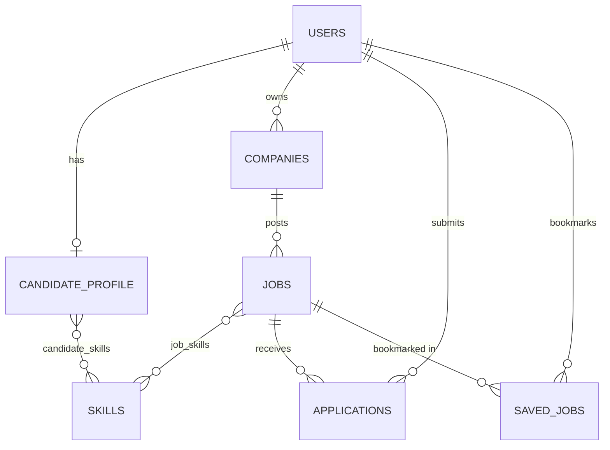
*(Resume is stored as a URL + extracted text on `candidate_profile`, not a separate table.)*

## Deployment

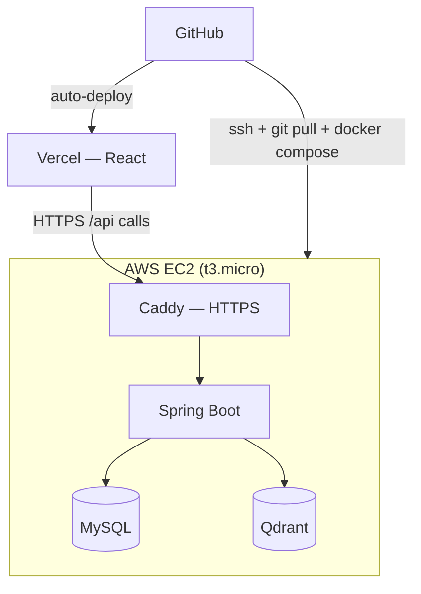

## Testing

JUnit 5 + Mockito **unit tests on the service layer** (7 test classes) — they mock repositories and external clients, so they're fast and don't need a DB or network. Coverage focuses on the logic that's easy to get wrong:
- RBAC / ownership checks, duplicate-apply → 409, admin can't disable themselves
- AI match logic — graceful when AI is off, Qdrant ranking order preserved, missing ids dropped, non-owner → 403

**Not yet (on the roadmap):** MockMvc / web-layer tests, integration tests with Testcontainers, and a Postman collection.

## API

**Swagger UI** (auto-generated, try-it-out + JWT Authorize): [/swagger-ui/index.html](https://52-65-41-124.sslip.io/swagger-ui/index.html) · OpenAPI spec at `/v3/api-docs`.
27 endpoints under `/api`; protected routes need `Authorization: Bearer <token>`.

<details>
<summary><b>Full endpoint list</b></summary>

| Method | Endpoint | Access |
|---|---|---|
| POST | `/api/auth/register` | public |
| POST | `/api/auth/login` | public |
| GET | `/api/jobs` (search/filter/paginate) | public |
| GET | `/api/jobs/{id}` | public |
| GET | `/api/jobs/mine` | EMPLOYER |
| POST | `/api/jobs` | EMPLOYER |
| PUT | `/api/jobs/{id}` | EMPLOYER (owner) |
| DELETE | `/api/jobs/{id}` | EMPLOYER (owner) |
| POST | `/api/jobs/{id}/apply` | CANDIDATE (dup → 409) |
| GET | `/api/applications/me` | CANDIDATE |
| GET | `/api/jobs/{id}/applicants` | EMPLOYER (owner) |
| PATCH | `/api/applications/{id}/status` | EMPLOYER (owner) |
| GET / PUT | `/api/me/profile` | CANDIDATE |
| POST | `/api/me/resume` (PDF, multipart) | CANDIDATE |
| GET | `/api/me/saved-jobs` | CANDIDATE |
| POST / DELETE | `/api/jobs/{id}/save` | CANDIDATE |
| GET | `/api/candidates` , `/api/candidates/{id}` | EMPLOYER |
| GET | `/api/matches/jobs` | CANDIDATE |
| GET | `/api/matches/jobs/{id}/candidates` | EMPLOYER (owner) |
| GET | `/api/admin/stats` , `/api/admin/users` | ADMIN |
| PATCH | `/api/admin/users/{id}/enabled` | ADMIN |
| GET | `/api/me` , `/api/health` | logged-in / public |

**Example — login** → `200`
```json
// request
{ "email": "ravi@example.com", "password": "your-password" }
// response
{ "token": "eyJhbGciOiJI...", "userId": 5, "email": "ravi@example.com", "fullName": "Ravi Kumar", "role": "CANDIDATE" }
```
</details>

## Run locally

**Frontend**
```bash
cd frontend
npm install --legacy-peer-deps
npm start            # http://localhost:3000
```

**Backend + MySQL + Qdrant (Docker)**
```bash
JWT_SECRET=<a-long-random-secret> docker compose up --build
```

**Environment variables** (backend reads from env; sensible defaults for local dev):

| Variable | What it does | Required |
|----------|-------------|----------|
| `JWT_SECRET` | signing key for JWT | yes (32+ chars) |
| `DB_PASSWORD` | MySQL root password | no (empty = passwordless local) |
| `GEMINI_API_KEY` | Gemini key for embeddings | no (empty = AI features off) |
| `QDRANT_URL` | Qdrant endpoint | no (defaults to `localhost:6333`) |

Or run the backend with Maven (JDK 21) against a local MySQL — copy `backend/.env.example` first.

## What I ran into (and learned)

The bugs taught me more than the happy path. Grouped by where they hit:

**Frontend**
- *Tailwind vs Mantine theming* — each has its own color config, so my custom palette only showed up in one of them. Fixed by defining the same colors in both `tailwind.config.js` and the Mantine theme.
- *Custom multi-select* — built the tag-style skill picker by hand instead of a library; learned a lot about controlled components and React state.

**Backend**
- *404 instead of 403 on protected routes* — Spring Security re-dispatches to `/error`, which was getting blocked. A global exception handler (+ permitting `/error`) fixed it and made the filter chain click for me.

**Infrastructure**
- *App wouldn't boot on a 1GB EC2* — out of memory on startup. Added swap and capped the JVM + MySQL memory. Local vs a tiny cloud box are genuinely different.

**Deployment**
- *Images 404'd only in production* — worked on Windows, broke on the live Linux box. Windows ignores filename case, Linux doesn't (`Girl.png` vs `girl.png`).
- *Embedding model 404* — `text-embedding-004` wasn't available for my key; switched to `gemini-embedding-001` (verified the available models first).
- *Empty matches after deploy* — embed-on-write doesn't backfill, so existing data had no vectors. Re-saved jobs/profiles to index them into Qdrant.

## Status

Auth + RBAC, core features (jobs, applications, profiles, talent), the three role dashboards, **and AI matching are all live in production** (Gemini + Qdrant on EC2). Next: a reindex/backfill endpoint, then a role-aware AI chatbot (tool-calling agent), and more test coverage (MockMvc / integration).

---
Built by **Sumeet Kumar (SKY)** · [github.com/iamsky2002](https://github.com/iamsky2002)
